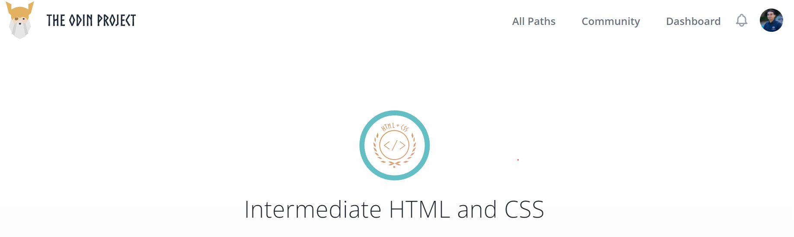
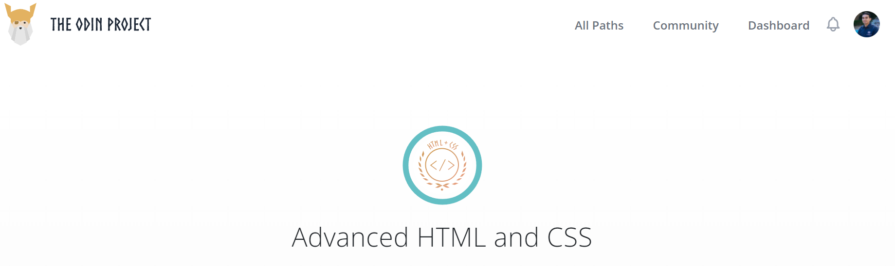

<h1 align="center">
[The Odin Project: Intermediate & Advanced HTML/CSS] - List of Completed Projects
</h1>

<!-- AUTO-GENERATED-CONTENT:START (STARTER) -->

  
  

## Intro

Here you will find all the projects that I completed along with their GitHub Repo for the Intermediate and Advanced HTML/CSS modules in the Odin Project.

The Intermediate course consisted of 21 lessons and 2 projects. I learned the following:
-   HTML
    -   Using Emmet in VS code to be more productive
    -   Form basics and validation
    -   Media: SVGs, JPG, and PNGs and when to use each one
    -   HTML Tables 
    -   Setting up authentication using PassportJS
-   CSS
    -   Using **advance selectors** to not have to create unnecessary html classes
    -   Learning about positining and the difference between relative, absolute, sticky 
    - Establish a foundation in CSS Grid!

For the projects I challenged myself to practice everything I learned here by:
-   Creating a design of how I want the application to look like and brainstorm what layout system will I use to place all my content (Grid or Flexbox)
-   Using advanced selectors to minimize use of unnecessary classes
-   Minimizing the use of unnecessary HTML tags and only using what is needed
-   Using semantic html tags  

The Advanced course consisted of 15 lessons and 1 projects. I learned the following:
- Animations: How to make animations using CSS and which ones to use
- Accessibility: I learned how websites need to follow a set of guidelines to make it easier for everyone to navigate your site. Online tools can help us check how accessible our website 
- Responsive design: I learned how elements in a website are naturally responsive, it is when we start adding CSS that we make them unresponsive

## The projects:

1.  [The Odin Project: Intermediate HTML & CSS] - Sign Up Form

    -   [Code](https://github.com/salvillalon45/theOdinProject-SignUpForm)
    -   [Live Site](https://odin-signupform-sv.netlify.app/)

2.  [The Odin Project: Intermediate HTML & CSS] - Admin Dashboard

    -   [Code](https://github.com/salvillalon45/theOdinProject-AdminDashboard))
    -   [Live Site](https://odin-admindashboard-sv.netlify.app/)

3.  [The Odin Project: Advanced HTML & CSS] - Personal Portfolio

    -   Now that I have completed the Odin Project. I can now fully work on my Personal Portfolio
